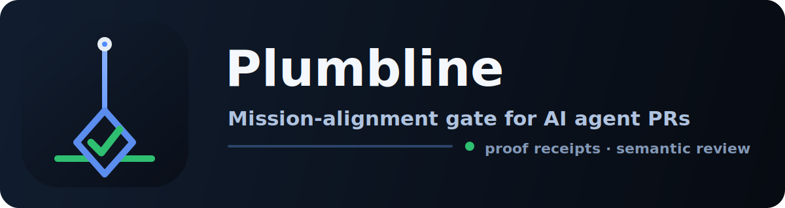

# Plumbline

<!-- Social preview (manual, human-only repo step): GitHub's Settings → Social preview
     does NOT accept SVG. Upload assets/plumbline-social-preview.png (1280×640) there by hand —
     it's a repo-settings action, not something the repo can commit. -->

*“Behold, I will set a plumb line in the midst of my people” — Amos 7:8. The prophet’s own symbol: the line work is measured against.*

**A proof-carrying gate for AI agent work.** Agent PRs ship with a structured receipt; a deterministic shape check and an LLM semantic review judge the work against your repository's mission before a human ever reads the diff. Failed reviews produce a structured *failure capsule* the agent can use as its rework prompt.

Extracted from the [AMOS](https://github.com/amos-labs) proof-carrying autonomous loop. Apache 2.0.

**Plumbline gates Plumbline.** This repo runs its own gate on every PR — self-modifying changes to the gate itself route to human review. The loop is proven on the tool that implements it.

**Compatible with [OpenSpec](https://github.com/Fission-AI/OpenSpec). Dependent on nothing.** The intake and archive ends of the loop follow OpenSpec's format and lifecycle conventions (MIT — see `THIRD-PARTY.md`), so existing `openspec/` folders just work — and every stage is adoptable on its own.

## Why Plumbline

AI writes most of the code now; the bottleneck is no longer typing — it's **trust**. When an agent opens a PR, a human still has to reconstruct what it was trying to do, whether it actually did that, and whether it stayed inside what the project is *for*. That reconstruction doesn't scale.

Plumbline makes the work **prove itself**: every agent PR carries a receipt (intent, checks, evidence) bound to the real diff; a deterministic check confirms the receipt matches reality; an LLM reviews it against your repo's written mission; anything touching a protected surface routes to a human. What's left to read is a verdict and a reason — not a diff to re-derive.

**This is the path to fully autonomous agent work** — not faster review, but review you can trust to run *unattended*. Once agents write the code, alignment (not speed) becomes the scarce thing, and Plumbline is where you make it enforceable.

## Three ways in — adopt what you want

Every stage stands alone; none requires the previous one.

1. **Gate-only (5 minutes).** `plumb init` scaffolds a **correct-by-default** governed CI (the gate workflow with the ci-evidence poll-wait already wired, `.plumbline/` policy + mission + `AGENTS.md`, and — on a detected stack — a stack preset), then `plumb setup-protection --repo owner/name` makes the gate a required, blocking check with auto-merge in one command. Agents ship receipts via `plumb receipt --write`. You get the proof half: every PR hash-bound to a receipt, judged against your mission.
2. **The full loop.** `propose → work → receipt --write → check → gate → archive` — intake contracts, proof, and living specs, one tool end to end.
3. **Bring your OpenSpec.** Already spec-driven? Your `openspec/changes/` folders are the contract: `plumb receipt --write` binds the diff to them and `plumb archive` applies your deltas to `openspec/specs/` — no workflow change.

## Quick start (agent-installable)

**Recommended onboarding — two commands set up the whole governed CI correctly:**

```bash
# 1. Scaffold a correct-by-default governed CI. On a Cargo.toml + migrations/ + sqlx
#    repo this auto-detects the `rust-sqlx` preset; force one with --stack, or skip
#    presets with --no-stack.
npx github:amos-labs/plumbline init

# 2. Make the gate + CI checks REQUIRED and blocking on the default branch, and turn
#    on auto-merge — the "blocking + auto-merge on all green" shape. Idempotent.
GITHUB_TOKEN=<repo-admin token> npx github:amos-labs/plumbline setup-protection --repo owner/name
#    (or fold it into step 1: `plumb init --protect --repo owner/name`)
```

`init` lays down, **correct out of the box, no hand-editing**:

- **`.github/workflows/plumbline.yml`** — the gate, WITH the **ci-evidence poll-wait
  already wired** so the gate waits for the repo's CI checks to reach a terminal
  conclusion before it evaluates (it never races CI). Poll timeout is configurable
  via the repo/org variable `PLUMBLINE_POLL_TIMEOUT_SECONDS` (default 900s).
- **`.plumbline/`** — `policy.json`, `MISSION.md`, and an **`AGENTS.md`** that tells an
  AI agent exactly how to satisfy the gate (including the migration + receipt-authoring
  conventions, so agents don't fight the gate on CI bookkeeping), plus an example receipt.
- **Stack preset (auto-detected or `--stack`).** On a **`rust-sqlx`** repo (Cargo.toml +
  `migrations/` + sqlx): a **migration-version-collision guard** (fails a PR whose new
  migration version ≤ the base branch's max), **rust-cache** + **parallelized** test jobs
  (no `needs:` chain), the policy's `ci_evidence_checks` pre-bound to those jobs, and —
  if a `Dockerfile` is present — a **cargo-chef** layering + `cache-to mode=max` hint (the
  thing that makes warm deploys fast). Everything is a plain file you can edit or delete —
  presets are a starting point, not a lock-in.

`setup-protection` makes the `plumbline` gate + the repo's CI checks required status
checks on the default branch (`strict:false`) and enables auto-merge — the misconfiguration
that a hand-build reliably gets subtly wrong (gate not actually required, so the gate is an
advisory comment rather than a block). It's idempotent and prints exactly what it changed;
needs a token with repo-admin (`admin:org` / `repo`) scope. It's **non-destructive**: it
reads the current branch protection first and **preserves** any existing required reviewers
(`required_pull_request_reviews`) and push restrictions (`restrictions`) — it only ADDS the
required checks, never nulls those. If it can't read the current protection, it refuses to
write unless you pass `--force`.

Then the full lifecycle — **propose → work → prove → gate → archive** — starts at intake:

```bash
npx github:amos-labs/plumbline propose "Rotate auth session tokens" --body "Tokens never expire today."
# → opens the GitHub issue AND scaffolds openspec/changes/rotate-auth-session-tokens/
#   (proposal.md + specs/ + tasks.md), born linked: the issue number is written into the
#   proposal's task_id front-matter, the issue body carries the contract path. Prints an
#   informational self_modifying prediction from the policy's protected paths.
#   --lite = plain issue, no contract folder (typo-fix-grade work).
# …fill the contract's Why / What Changes / Scope (judgment — yours), get it approved, do the work…
```

Then the per-PR loop (no human needed after one-time setup):

```bash
npx github:amos-labs/plumbline receipt --write   # one idempotent step: scaffold .plumbline/receipts/<branch>.json
                                                 # (or refresh it) with ALL mechanical fields computed —
                                                 # diff_sha256, changed_files, and self_modifying derived from
                                                 # the policy's protected paths. Judgment fields never touched.
# …fill intent / validation_plan / execution_evidence / result_summary (the judgment half — yours to assert)…
npx github:amos-labs/plumbline check             # local pre-flight — the SHAPE floor + diff_sha256 only (fast, offline, free).
                                                 # NOT the full verdict: the LLM semantic review runs in CI.
npx github:amos-labs/plumbline check --review    # full parity — also runs the semantic review locally for the real verdict
                                                 # (needs ANTHROPIC_API_KEY / PLUMBLINE_API_KEY; degrades to shape-only without one).
```

> **`check` vs the CI gate.** Default `plumb check` verifies only the *shape* dimension
> (receipt well-formed, `diff_sha256` matches the diff, protected-path floor) — it
> deliberately does **not** call the LLM, so it stays fast/offline/free and prints a
> scoped `shape pre-flight: PASS/FAIL` banner, never a bare `APPROVE`/`REVIEW`/`REWORK`.
> A shape-PASS locally can still land on `REVIEW`/`REWORK` in CI once the semantic review
> runs. Use `plumb check --review` to run that review locally and get the full verdict
> before pushing.

> **Phased gate (fail-cheap-first).** By default the CI gate is one run
> (`--phase full`): shape + ci-evidence + semantic review on every push. On a
> repo with a slow (~30-min) test suite that means an agent fixing a REWORK pays
> the whole suite again — the slowness that makes people route around the gate.
> The gate can instead run in **stages**, so the agent's iterate loop spins
> against the cheap ~2-min phase and the suite fires ONCE, only after the code is
> known-solid:
>
> - **`plumb run --phase quality`** (phase 1) — shape + semantic review only.
>   **ci-evidence is skipped** (tests haven't run). A REWORK fails fast so the
>   workflow's `needs:` gate blocks phase 2; a clean phase 1 passes so it
>   proceeds. A phase-1 result reads explicitly as "tests were SKIPPED" — never
>   "tests passed".
> - **`plumb run --phase verify`** (phase 2) — the ci-evidence gate + the
>   terminal PASS / REWORK / REVIEW verdict, after the suite has run.
>
> Wire it as `quality → tests (needs: [quality]) → gate (needs: [tests])`. Copy
> [`templates/workflow-staged.yml`](templates/workflow-staged.yml) to get the
> three-job pipeline. `--phase full` stays the default — non-staged consumers
> need no change.

After more commits or a rebase, just run `receipt --write` again — it refreshes the
mechanical fields and preserves everything you wrote. `receipt --check` (exit 1 when
stale) is small enough for a pre-push hook. One receipt file per PR at
`.plumbline/receipts/<task>.json` — never a shared `receipt.json`. (Legacy `.proofgate/` repos work unchanged — the tool reads both.)
The split is deliberate: **automate the bookkeeping, never the judgment** — the tool
computes what's derivable (hashes, file lists, protected-path human-review routing) and refuses
to write what only the author can assert. (`new` and `stamp` remain as the underlying
single-purpose commands.)

And once the PR is merged, close the loop — recorded truth:

```bash
npx github:amos-labs/plumbline archive rotate-auth-session-tokens
# → applies the change's ADDED/MODIFIED/REMOVED spec deltas to openspec/specs/ (the living
#   source of truth a fresh agent reads to know how the system behaves), then moves the
#   change to openspec/changes/archive/<date>-rotate-auth-session-tokens/ with full context.
#   Refuses unless the change's receipt passes the gate — proof precedes truth (--force overrides, loudly).
```

`init` prints the two human-only steps (make `plumbline` a required check; add the
`ANTHROPIC_API_KEY` secret) — also spelled out in `.plumbline/AGENTS.md`. See that
file for the full agent guide.

## Teach your agent the gate

The action enforces; the **[`plumbline` skill](skills/plumbline/SKILL.md)** teaches.
`init`'s `AGENTS.md` is per-repo and drifts; the skill travels with your agent across
every repo, loads whenever it sees a `.plumbline/` directory (or gets asked about
receipts, verdicts, or the gate), and carries the judgment AGENTS.md can't: how to
write receipts that deserve to pass, and how to behave on REWORK vs REVIEW. This repo
is also a Claude Code plugin — two commands make any Claude gate-native:

```shell
/plugin marketplace add amos-labs/plumbline
/plugin install plumbline@amos-labs
```

The plugin ships the skill only — install `plumb` itself per the
[Quick start](#quick-start-agent-installable) above (`npx github:amos-labs/plumbline`).
Other harnesses can drop [`skills/plumbline/SKILL.md`](skills/plumbline/SKILL.md)
straight into their agent instructions.

## The problem

AI agents multiply your velocity until the codebase quietly diverges from your intent — every PR looks fine, the project drifts. Reviewing everything yourself caps velocity at your reading speed. Trusting the agent loses the project over time. Plumbline is the missing middle: **legibility as the control surface.** Work carries proof; humans review exceptions.

## How it works

```text
agent does work
  -> emits .plumbline/receipt.json   (intent, validation plan, evidence, changed files, self_modifying flag)
  -> shape gate                       deterministic: schema, evidence coverage, protected paths, SHA/diff integrity
  -> semantic review                  one LLM call vs your MISSION.md: coverage, alignment, risk
  -> verdict = whose turn it is
       approve   -> CI check green, merges automatically (no blocking findings)
       rework    -> the agent's turn: fix the 🤖 items and re-push (no human needed)
       review    -> the human's turn: decide the 🧑 items (zero 🤖 items by construction)
```

Two-tier validation, on purpose: the shape gate never pretends to understand meaning, and the reviewer never re-does deterministic checks.

**The verdict is whose turn it is — exclusively.** It is derived mechanically from the
classified findings, not taken from the model. Each finding is tagged on two axes:
`class` (`blocking` — a defect: failed/missing validation, a bug, a security regression,
receipt≠diff, an untested critical path — or `advisory` — a "consider…", a style nit, a
nice-to-have) and `actor` (`agent` — an agent can fix it now — or `human` — needs human
judgment). The rule:

- **Any blocking + agent finding ⇒ REWORK**, the agent's turn — *even on a protected /
  `self_modifying` path.* The protected floor only forbids auto-APPROVE; it never skips
  the agent's rework phase. A REWORK self-clears on re-push once the agent set is empty.
- **REVIEW** is emitted only when the blocking + agent set is *empty*, so a REVIEW is by
  construction a pure human decision list — **zero 🤖 items**. A REVIEW never self-clears;
  the human decides it (protected-surface override, a real trade-off, or ambiguous intent).
- **Advisory findings never gate.** They render in their own 💡 section and are recorded
  in the capsule; they never affect the verdict and never block a merge.

Lifecycle: **REWORK → (agent fixes, re-push) → … → REVIEW (humans-only) or APPROVE.**

How aggressively judgment calls route to a human vs. an agent is the `human_review_level`
dial (`low` / `balanced` / `high`) in `policy.json` — it tunes the agent/human split of
blocking findings only and never lowers the hard floor (protected paths + `self_modifying`
always need a human before merge).

**Re-review is convergent (delta), not a fresh pass.** On a re-review the prompt receives
the prior capsule + the fix commits; its contract is (a) verify the previously-named
blocking items were addressed and (b) review ONLY the new/changed hunks for regressions —
it must not raise fresh findings on unchanged code it already reviewed. A **convergence
cap** bounds the loop: after 2 rework rounds only regressions in the fix commits may
block; anything else escalates to REVIEW under a "gate did not converge — human decides"
banner. No unbounded nitpick loops.

**The gate fails CLOSED.** A proof-carrying trust gate that passes on the deterministic
shape half alone when the semantic review couldn't run would fail *open* — the exact bug
the tool exists to prevent. So when the semantic review is required and **cannot run** — no
API key, a provider construction error, an API error, or a timeout — the verdict is a
**BLOCK** (`review`, with a loud *"semantic review unavailable — failing closed"* capsule),
never a silent shape-only pass. This is governed by `require_semantic_review` in
`policy.json`, which **defaults to `true`**.

For a deliberately offline / self-hosted / air-gapped repo that runs the deterministic
shape gate without an LLM, set `require_semantic_review: false`. That is an **explicit
opt-out**: the shape gate can PASS, but the verdict and the PR comment state *loudly* that
the semantic review did **not** run — the gate never silently pretends judgment happened.
(This is orthogonal to the `skip_review` cost knobs, which are intentional per-diff skips
that still count as a completed review decision.)

**Transient GitHub outages are INDETERMINATE, not REWORK (v0.6.1).** *Could not evaluate*
is a different thing from *the code needs rework* — conflating them (a 503 becoming a hard
REWORK) trains humans to merge past REWORKs and defeats the gate. So the GitHub API calls
the gate makes (the PR + check-runs fetches behind ci-evidence) **retry with exponential
backoff + jitter** on transient failures — HTTP 5xx (500/502/503/504), 429, and network
errors (ECONNRESET/ETIMEDOUT/socket hangups) — while real 4xx auth/permission errors
(401/403/404) are never retried. If a transient failure survives every retry, the gate
emits a distinct **`INDETERMINATE`** (🔌 *infra_error*) outcome: a check-run named
`Plumbline: INDETERMINATE — could not evaluate (GitHub infra error)` (conclusion
`action_required`) and a PR comment that states plainly it is **neither a REWORK nor an
approval** — the gate never assessed the code. It **blocks auto-merge** (non-zero exit —
nothing was verified) and is trivially **re-runnable**: a fresh gate run once GitHub
recovers produces a real verdict.

### What "proof" means here

Be precise about the claim. A plumbline receipt binds three things:

1. **Diff-binding** — `diff_sha256` cryptographically binds the receipt to the exact diff it
   describes (the gate recomputes it; a stale/forged hash fails the shape gate).
2. **CI evidence** — required checks are corroborated against the repo's *real* CI check-runs
   (`ci_evidence_checks`), not the receipt's self-report.
3. **Probabilistic semantic review** — one LLM call judges coverage, mission alignment, and
   risk. It is a *judgment*, not a proof — strong signal, but fallible, and that's why the
   gate fails closed rather than pretending a missing review was a pass.

What "proof" is **not** (yet): a **cryptographic attestation** of the *work* — a signed
receipt whose signature a third party could verify offline. Receipt signing is **planned**,
not shipped. Today "proof-carrying" means *diff-bound + CI-corroborated + semantically
reviewed*, gated on a real judgment having happened — not a cryptographic proof of the agent's
behavior. We keep that distinction honest on purpose.

### What the gate posts

A REVIEW verdict renders on the PR like this — the human reads a verdict and a reason, not a diff:

```markdown
## ⚠️ plumbline: REVIEW

> **⚠️ Human approval required — no agent rework needed, but this is NOT a rubber stamp.** A maintainer decides the 🧑 items below (protected surface, a real trade-off, or ambiguous intent). **Read the review findings (risk + validation notes) before override-merging:** `gh pr merge <PR> --squash --admin`.

> 📋 **Review findings below — don't merge without reading them:** 1 risk finding, plus validation-coverage and mission-alignment notes.

**Shape gate:** pass

**Semantic review:** review (confidence 0.86)

- **Validation coverage:** `cargo test` covers the new token-refresh path; no test asserts the *old* session is invalidated after rotation — the security-relevant half of the change is unverified.
- **Mission alignment:** In scope — session hardening is squarely within the auth mission. No mission invariant is weakened.
- **Risk:** 1) Rotating tokens touches `src/auth/` — a protected surface — so a human must confirm the migration path can't strand live sessions.

### What's needed — protected_paths
_The change is sound and in-scope, but it edits a protected surface (`src/auth/**`) and self_modifying is set, so it cannot auto-approve._

#### 🧑 Human must decide
- [ ] Confirm existing sessions are invalidated (not silently kept valid) after a token rotation, then override-merge.

#### 💡 Advisory — non-blocking (does not gate the merge)
- Consider logging rotation events at `info` so the change is observable in prod.

<details><summary>Full capsule (JSON)</summary>

```json
{
  "failing_check": "protected_paths",
  "suspected_cause": "Protected surface (src/auth/**) touched; self_modifying requires a human.",
  "human_actions": [
    "Confirm existing sessions are invalidated (not silently kept valid) after a token rotation, then override-merge."
  ],
  "agent_actions": [],
  "advisory": [
    "Consider logging rotation events at info so the change is observable in prod."
  ],
  "next_action_requested": "Human decides the 🧑 item, then override-merges."
}
```
</details>

<sub>plumbline · proof-carrying gate for agent work</sub>
```

## Quick start

1. **Write your constitution.** Copy `templates/MISSION.md` to `.plumbline/MISSION.md` and fill it in. This is the highest-leverage hour you'll spend: state what the project is for, the invariants no change may weaken, and which surfaces are protected.

2. **Add the policy.** Copy `templates/policy.json` to `.plumbline/policy.json`. Set `required_checks` (commands every validation plan must include, e.g. your test suite) and `protected_paths` (globs that force `self_modifying: true` and human review).

3. **Add the CI hook.**
   - **GitHub:** copy `templates/workflow.yml` to `.github/workflows/plumbline.yml`, add `ANTHROPIC_API_KEY` to repo secrets, make the check required in branch protection.
   - **Azure DevOps:** copy `templates/azure-pipelines.yml`, add `ANTHROPIC_API_KEY` as a secret variable, grant the build service "Contribute to pull requests", and add the pipeline as a required build validation policy. The gate posts/updates a PR thread (active on rework/review, resolved on approve).

4. **Teach your agent the contract.** Add to your `CLAUDE.md` / agent instructions: every PR must include a receipt conforming to `templates/receipt.example.json`, with real evidence from commands actually run.

   **Use one receipt file per PR: `.plumbline/receipts/<task_id>.json`** (e.g. `.plumbline/receipts/ISSUE-142.json`). Because each PR writes a *different* filename, many PRs can be open at once without ever conflicting on the receipt — essential for autonomous / parallel agent work. The gate auto-discovers the receipt added in the PR's diff. The legacy single-file receipt (and the whole `.proofgate/` dir from the tool’s pre-rename era) still works for one-PR-at-a-time repos.

## Pinning a version

**Pin a released tag, not `@master`.** In your workflow, reference the action by a
released major tag:

```yaml
- name: Plumbline gate
  uses: amos-labs/plumbline@v1   # released major tag — moves forward within v1 only
```

- **`@v1`** (a moving major tag) — tracks the latest `v1.x.y` release. Recommended for
  most consumers: you get patches and non-breaking features automatically, and a major
  bump (`v2`) is an explicit, deliberate opt-in.
- **`@v0.2.0`** (an exact release) — fully pinned; nothing moves until you change it.
  Use when you want a change to be a reviewed diff in your own repo.
- **`@master`** — *don't.* Floating on the default branch means the gate's behavior can
  change under you with no version bump — a supply-chain risk for a security-relevant
  check, and the reason a `@v0`-pinned consumer (cuspr) got stuck behind the
  REVIEW/REWORK rename with no newer tag to move to. Released tags let consumers
  (managed-platform, 2.0, protocol, cuspr) upgrade **deliberately**.

Releases are cut from semver tags and carry notes from
[CHANGELOG.md](CHANGELOG.md). See **[RELEASING.md](RELEASING.md)** for how a maintainer
cuts a release and moves the major tag.

> Pinning is also *why behavior changes ship in a release, not silently.* The fail-closed
> default (`require_semantic_review: true`) is one such change: a `@master` consumer would
> have inherited it with no version bump, whereas a tag-pinned consumer upgrades into it
> deliberately after reading the CHANGELOG. Pin a tag.

## CLI

The complete command set, in lifecycle order:

```bash
plumb init             # scaffold a correct-by-default governed CI: gate workflow (WITH ci-evidence
                       #   poll-wait) + .plumbline/ + AGENTS.md, and on a detected stack the stack preset
                       #   ([--stack rust-sqlx] to force, [--no-stack] to skip, [--protect] to also run
                       #   setup-protection) — start here
plumb setup-protection # make the gate + CI checks REQUIRED (strict:false) on the default branch + enable
  --repo owner/name    #   auto-merge — the "blocking + auto-merge on all green" shape. Idempotent; prints
                       #   what it changed. Needs GITHUB_TOKEN with repo-admin scope. [--check name] repeats
                       #   for extra required checks; [--branch b]; [--dry-run]
plumb migration-guard  # (rust-sqlx) fail if a new migration's version <= the base branch's max — the
                       #   collision guard the scaffolded migration-guard.yml job runs [--base ref] [--dir]
plumb propose "<ask>"  # intake: GitHub issue + openspec/changes/<slug>/ contract folder, born linked
                       #   (--lite = plain issue, no folder — typo-fix-grade work)
plumb receipt --write  # one idempotent step: scaffold or refresh the per-PR receipt's mechanical fields
                       #   (diff_sha256, changed_files, self_modifying) — judgment fields never touched
plumb receipt --check  # mechanical staleness only; exit 1 if stale — pre-push-hook friendly
plumb new              # lower-level: scaffold a fresh per-PR receipt (receipt --write supersedes)
plumb stamp            # lower-level: fill diff_sha256 + changed_files only (receipt --write supersedes)
plumb check            # local pre-flight: SHAPE floor + diff_sha256 only (scoped banner, not the full verdict)
plumb check --review   # full parity: shape + semantic review locally (needs a key; degrades to shape-only without one)
plumb shape            # deterministic checks only — fast, no API key needed
plumb review           # shape + semantic review, prints JSON verdict
plumb run              # CI mode: shape + review + posts/updates the PR comment
plumb run --phase quality  # phased gate, phase 1: shape + semantic ONLY (ci-evidence skipped — tests not yet run)
plumb run --phase verify   # phased gate, phase 2: ci-evidence + terminal verdict (assumes phase 1 passed)
                       #   (default --phase full = all-in-one; back-compat for non-staged consumers)
plumb archive <slug>   # close the loop: apply the change's spec deltas to openspec/specs/ (the living
                       #   source of truth), move it to openspec/changes/archive/<date>-<slug>/;
                       #   refuses unless the receipt passes the gate (--force overrides, loudly)
plumb schema           # print the receipt field reference
```

`stamp` + `check` close the loop in the working tree: `stamp` generates the two most error-prone,
recompute-on-every-edit fields (`diff_sha256`, `changed_files`) with the exact computation the gate
uses, and `check` runs the same shape + diff-integrity verification the CI action does — so receipt
errors are caught before pushing, instead of via a red CI round-trip (which burns Actions minutes).
Author the intent/plan/evidence; let `stamp` handle the mechanical fields.

Common flags: `--receipt <path>` `--policy <path>` `--base <ref>` `--mission <path>` `--no-git` (fixture testing).

Exit code is the gate: `0` only on approve.

### Compatibility / legacy naming (why you still see `proofgate`)

This project was renamed **proofgate → Plumbline**. If you were an early adopter, nothing
breaks — the old names are retained **on purpose** as aliases, not left behind as
deprecation surprises:

- **`.proofgate/`** config and receipt dirs are still read (a repo with `.proofgate/` keeps
  working with no changes).
- **`PROOFGATE_*`** env vars still work as aliases for the `PLUMBLINE_*` ones
  (`PROOFGATE_API_KEY`, `PROOFGATE_MODEL`, `PROOFGATE_PR_NUMBER`, `PROOFGATE_AGENT_ID`, …).
- **`proofgate`** is a CLI-command alias for **`plumb`**.
- Gate comments posted by the pre-rename version (footer `proofgate · proof-carrying gate`)
  are still recognized on re-run so history isn't lost.

**New users:** use `.plumbline/`, `PLUMBLINE_*`, and `plumb`. The `proofgate` names exist only
for back-compat and won't be removed out from under existing adopters.

### Evidence integrity (`ci_evidence_checks`)

`execution_evidence[].status` in the receipt is *self-reported* — by itself the gate would be
taking "the suite passed" on faith. Set `ci_evidence_checks` in the policy to the GitHub
**check-run names** that must actually conclude `success` for the PR head commit (e.g.
`["test"]`). In `run` mode the gate reads the **real** check-run conclusions for that commit and
fails if a required check didn't pass — so a receipt can't claim a passing suite the CI didn't
run. The receipt declares the *plan*; CI *proves* it. (Agents needn't fuss over self-reporting
status for these — CI is the source of truth, and an optimistic receipt is caught.)

### Tuning strictness (`strictness` / `check_severity`)

How much of the gate hard-fails is **policy, not code**. Two knobs in `policy.json`:

```jsonc
{
  "strictness": "standard",                        // strict (default) | standard | lenient
  "check_severity": { "undeclared_files": "off" }  // per-check override: error | warn | off
}
```

Every finding belongs to a named check: `schema`, `receipt_size`, `required_checks`,
`evidence_coverage`, `protected_paths`, `diff_integrity`, `undeclared_files`, `ci_evidence`.
Resolution: error (base) → preset → `check_severity` override. `warn` shows in the PR
comment without failing the gate; `off` suppresses with a note.

| Preset | Relaxes (→ warn) |
|---|---|
| `strict` (default) | nothing — every finding is an error |
| `standard` | `undeclared_files`, `receipt_size` |
| `lenient` | those + `required_checks`, `evidence_coverage`, `ci_evidence` |

**The floor never moves:** `schema`, `diff_integrity` (the hash binding), and
`protected_paths` (the `self_modifying` human-review routing) can never be downgraded —
a policy that tries gets a warning and they stay errors. They are the point of the tool.

### Choosing a review provider (no lock-in on intelligence)

The semantic review is one LLM call behind a small provider interface, so you are
not tied to one vendor. **Anthropic is the default and its env is unchanged**
(`ANTHROPIC_API_KEY`, `PLUMBLINE_MODEL`/`PROOFGATE_MODEL`). To point the gate at any
OpenAI-compatible endpoint (OpenAI, Azure OpenAI, Together, Groq, vLLM, Ollama's
OpenAI shim, LM Studio, a self-hosted model, …):

```bash
export PLUMBLINE_PROVIDER=openai
export PLUMBLINE_API_BASE=https://api.openai.com/v1   # or your self-hosted endpoint
export PLUMBLINE_API_KEY=sk-...                        # REQUIRED (PROOFGATE_API_KEY also accepted)
export PLUMBLINE_MODEL=gpt-4o-mini                     # provider-specific model id
```

Or set it in `policy.json` (`"review_provider": "openai"`, `"review_api_base": "…"`);
the env vars override the policy. The prompt and the `approve`/`rework`/`review`
verdict schema are identical across providers — only the transport changes.

A non-Anthropic provider needs its **own** key (`PLUMBLINE_API_KEY`) — the gate will
**not** fall back to `ANTHROPIC_API_KEY` for it, because sending your Anthropic key to a
third-party/self-hosted endpoint would leak that credential. **Missing key → the gate fails
closed** (verdict `review`) by default, not a shape-only pass — see
[the fail-closed behavior](#how-it-works) and `require_semantic_review`.

### Cost + determinism controls (opt-in)

The semantic review is the differentiated value, so nothing here makes judgment silently
optional — these controls reduce spend without weakening the gate, and **all default to
off** (review runs exactly as before). The one deliberate escape hatch is
`require_semantic_review: false` (offline/self-hosted), and even that fails *loud*, not
silent. Configure in `policy.json`:

```jsonc
{
  // Fail CLOSED when the required semantic review can't run (no key / provider
  // error / timeout): verdict = review, never a shape-only pass. DEFAULT true.
  // Set false ONLY for a deliberately offline/self-hosted repo — the shape gate
  // may then PASS, but the verdict/comment state LOUDLY that review did not run.
  "require_semantic_review": true,
  // Skip the LLM for low-risk diffs — pass on the shape gate alone.
  // HARD FLOOR: self_modifying / protected_paths changes are NEVER skipped.
  "skip_review": {
    "docs_only": true,          // every changed file is documentation
    "config_only": true,        // every changed file is config (or docs)
    "below_diff_chars": 0       // skip diffs smaller than N chars (0 = off)
  },
  // Reuse a verdict for an identical diff (by diff_sha256, scoped to
  // provider+model+prompt version) instead of re-calling the LLM.
  "review_cache": { "enabled": true, "dir": ".plumbline/cache/review" },
  // Budget / model tier.
  "budget": {
    "use_cheap_model": true,    // use cheap_model instead of review_model
    "cheap_model": "claude-haiku-4-5",
    "max_usd_per_pr": 0         // informational soft cap, recorded for audit
  },
  // Determinism: OPTIONAL and OMITTED by default (some Anthropic models reject
  // an explicit temperature). Set it (e.g. 0) to pin determinism where the model
  // supports it; env PLUMBLINE_TEMPERATURE overrides. Recorded in the verdict.
  "review_temperature": 0
}
```

Every verdict records its `audit` metadata (provider, model, prompt version, temperature,
and whether it was cache-served) so a decision is reproducible and explainable.

### Attempt history (reruns keep context)

The gate updates a single PR comment in place — but a rerun no longer erases the previous
result. Prior attempts are archived, newest first, in a collapsed **📜 Attempt history**
section (capped at 5), so an agent picking up a multi-round fix sees the whole trajectory —
what attempt #1 failed on, what changed — in one comment.

## The receipt

The contract an agent must satisfy (`templates/receipt.example.json`):

| Field | Meaning |
|---|---|
| `intent` | What this change is for, in plain language (min 40 chars — no "fix stuff") |
| `policy_refs` | Which mission/policy docs the agent read |
| `validation_plan` | Commands + *why each one covers the change* + required flag |
| `execution_evidence` | What actually ran, status, output reference |
| `changed_files` | Must account for the real diff — undeclared changes fail the gate |
| `diff_sha256` | sha256 of `git diff <base>...HEAD -- . ':(exclude).plumbline/receipt.json' ':(exclude).plumbline/receipts/*.json' ':(exclude).proofgate/receipt.json' ':(exclude).proofgate/receipts/*.json'` — **3-dot (merge-base), over the committed HEAD** (not `--cached`, not the working tree), receipts excluded. Binds the receipt to the diff so receipts can't be recycled. `<base>` is auto-detected (your default branch) — `origin/main` *or* `origin/master`. **Always run `plumb receipt --write` (or `plumb stamp`) rather than hand-computing** (`git diff --cached` / 2-dot give a different hash). Excluding the receipt makes it computable before the commit (a commit can't contain its own SHA); a content hash also survives GitHub's merge-ref checkout where a head SHA cannot. |
| `self_modifying` | True if protected surfaces are touched; removes any auto-approve path |
| `result_summary` | What a human should know before merging |

## Design rules inherited from AMOS

- **Self-modifying work has no auto-approve path.** Changes to auth, payments, migrations, the gate itself — whatever you mark protected — always require a human *before merge*, regardless of how good the review looks. The floor only forbids auto-APPROVE: a protected PR with agent-fixable defects still gets REWORK first (the agent iterates), and routes to REVIEW only once the agent set is empty.
- **Low confidence never auto-approves.** Verdicts below `min_review_confidence` are downgraded to review.
- **Failure capsules, not log dumps.** A capsule carries the failing check, suspected cause, implicated files, the classified findings split into 🤖 agent actions and 🧑 human actions, a separate 💡 advisory section, and a concrete next action — structured to be fed straight back to the agent. A REWORK capsule carries only 🤖 items; a REVIEW capsule only 🧑 items.
- **The gate protects itself.** `.plumbline/**` (and legacy `.proofgate/**`) and your workflows belong in `protected_paths`.

## Running agents at scale

Plumbline is the *gate*; pair it with an issue-tracker queue + an executor and you have
an autonomous delivery loop. See **[docs/AGENTS_ON_A_MISSION.md](docs/AGENTS_ON_A_MISSION.md)** —
a harness-agnostic pattern: queue in your issue tracker (a human-applied `agent-ready`
label), progress in a checkpoint file, discipline in hooks, judgment in this gate. Two
human checkpoints (apply `agent-ready` on intake; `self_modifying`/review on output)
let the middle run unattended.

## Operating notes (learned in production)

- **One receipt file per PR** (`.plumbline/receipts/<task_id>.json`) — many PRs open at
  once never conflict on the receipt. The gate auto-discovers the one in the diff.
- **Compute `diff_sha256` and write the receipt in the *same* step.** The hash is over
  the diff *excluding* receipt paths, so it's computable before committing the receipt —
  but shell variables don't persist across separate tool calls, so compute-and-write
  together or you'll ship an empty/stale SHA and fail the shape gate.
- **`self_modifying` PRs don't auto-merge** — wire auto-merge only for non-self_modifying
  green PRs; protected work waits for a human override-merge.
- **Mass-outbound / irreversible prod ops should be `human-only`**, not auto-drained.
- **Keep agent concurrency at 1–2** against a shared main branch.

## Status

v0.4.x — released from a semver tag with a [CHANGELOG](CHANGELOG.md) and a release
process ([RELEASING.md](RELEASING.md)); [pin a released tag](#pinning-a-version), not
`@master`. GitHub Actions + Azure Pipelines; Anthropic and OpenAI-compatible providers.

Current gate model:
- One idempotent authoring step — `plumb receipt --write` (scaffold if absent, else
  refresh the mechanical fields) — then fill the judgment fields and `plumb check`.
- Deterministic **shape** gate (schema, evidence coverage, protected paths, pinned-base
  `diff_sha256`) runs identically in `plumb check` and the CI gate — one implementation,
  no local/CI drift (#53).
- Semantic **review** classifies each finding on three axes — class (blocking/advisory),
  actor (agent/human), materiality (material/optional/noise) — and the verdict is derived
  mechanically: any material, agent-fixable finding ⇒ **REWORK** (agent iterates, even on a
  protected surface); a clean PR needing only human sign-off ⇒ **REVIEW**; otherwise
  **PASS** (#56). Optional-but-good findings are auto-filed as tracked follow-up issues
  rather than skipped; noise is dropped.
- The three verdicts are unmistakable end-to-end — distinct check-run name + conclusion
  (REWORK→`failure`, REVIEW→`action_required`, PASS→`success`), PR-comment title, and
  annotation, from a single source of truth (#54/#55).

Planned: drift monitoring (scheduled job sampling merged work against the mission),
Bedrock provider, explicit inline REVIEW-approve action, receipt signing.
